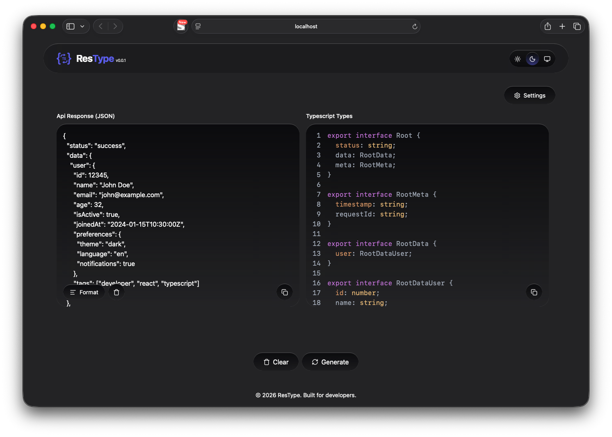
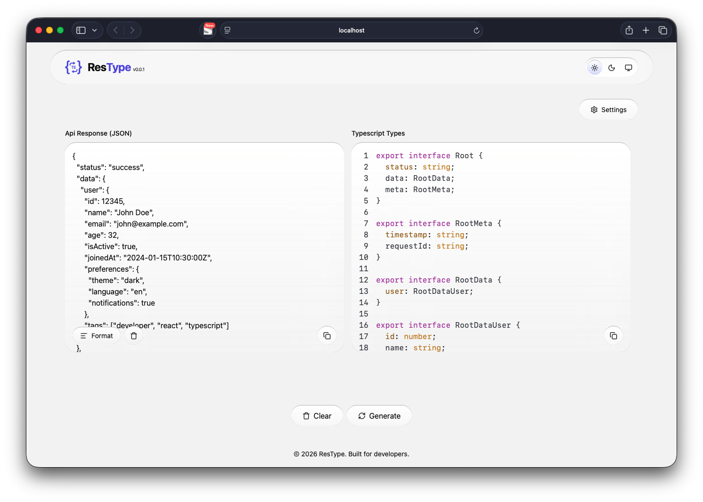

# ResType

A browser-based tool that instantly converts JSON responses into TypeScript interfaces or type aliases, eliminating the need to manually write types from API responses.

## Overview

ResType helps developers quickly generate TypeScript interfaces or type aliases from JSON data. It removes the repetitive task of manually creating types from API responses while providing a clean, responsive interface and developer-friendly features.

## Features

* Convert JSON into TypeScript interfaces or type aliases
* Syntax-highlighted output with line numbers
* Animated line-by-line code rendering
* Switch between Interface and Type Alias
* Toggle the `export` keyword
* Built-in JSON formatting and validation
* Copy generated code to the clipboard
* Dark, Light, and System theme support
* Fully responsive design

## Screenshots

<p align="center">
  
  
</p>

## Tech Stack

### Language

* TypeScript

### Framework

* React 19
* Vite 8

### Libraries

* Tailwind CSS 4
* Framer Motion
* Lucide React
* react-syntax-highlighter

## Getting Started

### Clone the repository

```bash
git clone https://github.com/alizs10/res-type-react.git
cd res-type-react
```

### Install dependencies

```bash
npm install
```

### Start the development server

```bash
npm run dev
```

Open the local URL displayed in your terminal (typically `http://localhost:5173`).

## How It Works

1. Paste a JSON object or API response into the editor.
2. The application validates and formats the JSON.
3. TypeScript types are generated instantly.
4. Choose between an interface or a type alias.
5. Copy the generated code with a single click.

## Connect

**Portfolio**
https://alizs10.ir

**LinkedIn**
https://www.linkedin.com/in/ali-z-soleimani-46a908237

**Email**
[alizswork@gmail.com](mailto:alizswork@gmail.com)

## License

This project is licensed under the MIT License.
